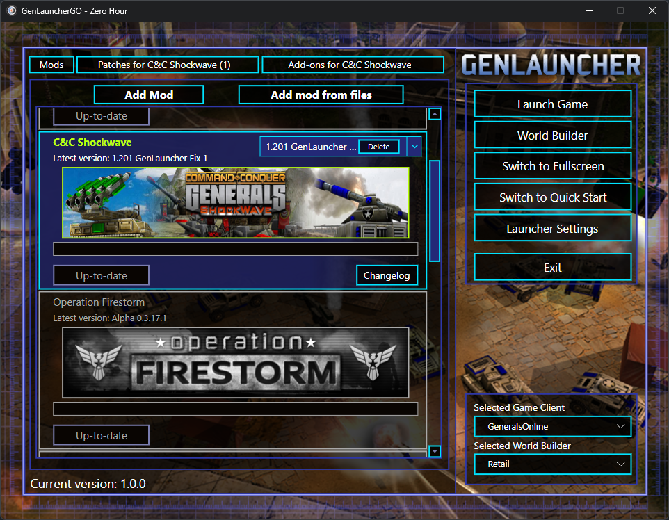

# GenLauncherGO

GenLauncherGO is a portable Windows mod manager and launcher for **Command & Conquer: Generals** and
**Zero Hour**. It supports the retail games alongside community clients from
[TheSuperHackers](https://github.com/TheSuperHackers/GeneralsGameCode) and
[GeneralsOnline](https://www.playgenerals.online/).

It downloads, installs, updates, and launches supported mods, patches, and add-ons while keeping supported game
installations as clean as possible. This codebase is a complete rewrite of
[x64-dev/GenLauncher_GO](https://github.com/x64-dev/GenLauncher_GO), which was derived from the original
[GenLauncher project](https://github.com/p0ls3r/GenLauncher).

## Features

- Manage mods, patches, add-ons, and manually imported content.
- Share configured Generals and Zero Hour installations across multiple mods.
- Manage both games from one portable launcher, with launcher-owned data kept beside the executable.
- Deploy content with hard links when possible, with a file-copy fallback.

## Requirements

- Windows 10 or 11 and permission to approve the administrator prompt.
- A clean Generals or Zero Hour installation with no other modifications in its game directory.
- A game installation outside Windows' `Program Files` directories when possible, because User Account Control
  (UAC) can interfere with modding tools.
- For best performance, keep GenLauncherGO and each game installation on the same NTFS volume. Otherwise, deployment
  uses file copies instead of hard links.

### Supported game clients

The following game clients are automatically detected in the configured game folder:

| Game | Client | Executable |
| --- | --- | --- |
| Generals or Zero Hour | Retail | `generals.exe` |
| Generals | TheSuperHackers | `generalsv.exe` |
| Zero Hour | GeneralsOnline | `generalsonlinezh.exe` |
| Zero Hour | TheSuperHackers | `generalszh.exe` |

### Supported World Builders

World Builder support is optional.

| World Builder | Executable |
| --- | --- |
| Original World Builder | `WorldBuilder.exe` |
| TheSuperHackers Generals | `worldbuilderv.exe` |
| TheSuperHackers Zero Hour | `worldbuilderzh.exe` |

Custom game client and World Builder executables can be registered under
**Launcher Settings > Custom executables**.

## Quick Start

1. Start with a clean game installation, preferably outside `Program Files`, and a compatible game client.
2. Download and extract the complete `GenLauncherGO-win-Portable.zip` outside any game installations, preferably on
   the same NTFS volume. Keep its files and folders together.
3. Run the root `GenLauncherGO.exe`, approve the Windows UAC prompt, and select one or both game installation folders.
4. Choose a game client and the content you want to use, then launch the game or World Builder.

GenLauncherGO temporarily deploys the required mod files into the game directory, launches the selected program,
and cleans up the deployed files after that process closes.

## Launcher Folder Layout

The portable package keeps its update machinery beside the root launcher and creates one user-owned
`GenLauncherGO Data` folder there. In the table below,
`<game>` is either `C&C Generals Data` or `C&C Zero Hour Data`, and `<name>` identifies a content entry.

| Path | Purpose |
| --- | --- |
| `GenLauncherGO.exe` | Stable portable launcher entry point |
| `Update.exe` | Portable update host |
| `.portable` | Marker that prevents installer registration and shortcuts |
| `current\GenLauncherGO.exe` | Current application payload |
| `current\sq.version` | Installed package identity and version |
| `packages` | Downloaded update packages managed by Velopack |
| `GenLauncherGO Data\LauncherPreferences.yaml` | Launcher settings |
| `GenLauncherGO Data\<game>\Mods` | Installed mods, patches, and add-ons |
| `GenLauncherGO Data\<game>\Runtime\Cache\Images\<name>` | Downloaded or user-selected images |
| `GenLauncherGO Data\<game>\Runtime\Deployment` | Deployment manifests, journals, locks, and recovery backups |
| `GenLauncherGO Data\<game>\Runtime\Integrity` | Managed-content integrity snapshots |
| `GenLauncherGO Data\<game>\Runtime\State\LauncherData.yaml` | Local catalog state and installed-content metadata |
| `GenLauncherGO Data\<game>\Runtime\Temp` | Temporary download and installation staging, cleared on startup |
| `GenLauncherGO Data\Logs` | Rolling diagnostic logs |

GenLauncherGO checks its GitHub releases for a portable update at most once every 24 hours. An available update is
downloaded quietly, then the launcher offers **Restart now** or **Later**. Choosing Later suppresses the prompt for the
rest of that session; the downloaded update remains ready and can be applied on a later launch.

To migrate from an older single-executable release, close GenLauncherGO and extract the complete portable ZIP into
the existing launcher folder. Allow the package files to merge, but do not delete or replace `GenLauncherGO Data`.
Continue launching the root `GenLauncherGO.exe`.

## Contributing

Contributions are welcome. See [CONTRIBUTING.md](CONTRIBUTING.md) for development setup, architecture, testing,
publishing, and pull-request guidance.

## Support

- [GeneralsOnline website](https://www.playgenerals.online/)
- [GeneralsOnline Discord](https://discord.playgenerals.online)

Please use the GeneralsOnline Discord for bug reports, feature requests, support, and community discussion.

## Credits

- **p0ls3r** — Original creator of GenLauncher and the project from which the predecessor launcher was derived; also
  allowed GenLauncherGO to use the existing backend.
- **x64-dev** — Originator of the predecessor GenLauncherGO project and creator of GeneralsOnline.
- **Jaredl-Dev** — Rewrote the predecessor GenLauncherGO application.
- **Zeke** — Created the Generals and Zero Hour backgrounds used by the launcher.

## Donations

Want to support the original creator of GenLauncher? You can donate through
[Boosty](https://boosty.to/genlauncher/single-payment/donation/157147?share=target_link).

## Disclaimer

GenLauncherGO is a community-developed tool intended for retail game installations and community clients from
TheSuperHackers and GeneralsOnline. It is not created by, endorsed by, or affiliated with Electronic Arts or any other
rights holder unless explicitly stated.

This rewrite began as a personal project and is shared as a temporary community solution while
[GenHub](https://github.com/community-outpost/GenHub) matures toward becoming a stable, community-standard launcher.
GenLauncherGO is not presented as a perfect, permanent, or definitive solution.
